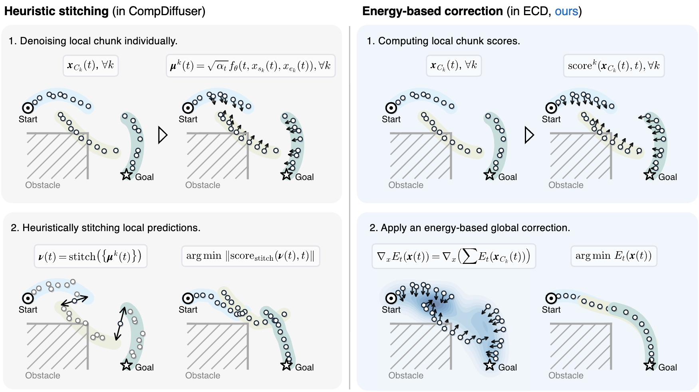

# ECD: Energy-based Compositional Diffusion Planning
[](https://arxiv.org/abs/2606.21646) [](https://huggingface.co/gradient-spaces/ECD) [](demo.ipynb) [](https://www.apache.org/licenses/LICENSE-2.0)

### ICML 2026

[Tao Sun](https://taosun.io/) <sup>1</sup>,
[Utkarsh A. Mishra](https://umishra.me)<sup>2</sup>,
[Jiaxin Lu](https://jiaxin-lu.github.io)<sup>3</sup>,
[Danfei Xu](https://faculty.cc.gatech.edu/~danfei/)<sup>2</sup>,
[Iro Armeni](https://ir0.github.io/)<sup>1</sup>


<sup>1</sup>Stanford University, <sup>2</sup>Georgia Institute of Technology, <sup>3</sup>University of Texas at Austin


*__Left__: The short trajectory fragments observed by the model during training.*
*__Middle__: Heuristic composition (CompDiffuser) suffers from mode drift, causing paths to cross through walls.* 
*__Right__: ECD uses a global energy function to maintain consistency and correct mode drift in CompDiffuser for long-horizon planning.*


## ✨ Features

* **Energy Formulation for Compositional Diffusion:** Instead of stitching local chunk predictions heuristically, ECD defines a single global energy function over all chunks, using its negative gradient to guide the denoising process, ensuring conservative score fields and consistent global modes.
* **Inference-Only:** Extends pretrained short-horizon diffusion models to long-horizon planning without retraining or fine-tuning.
* **Strong Performance:** Outperforms prior stitching methods (CompDiffuser) on long-horizon OGBench maze tasks, particularly on the largest environments.


## 🧠 How It Works

Long-horizon planning $x = [x_0, \dots, x_L]$ is typically approached by dividing a trajectory into overlapping chunks and deploying a short-horizon diffusion model on each.

Standard stitching methods (such as CompDiffuser) enforce consistency by averaging or overwriting overlapping segments at each denoising step. However, this creates a non-conservative score field with non-zero curl, meaning it does not correspond to the gradient of a valid global density function. This mismatch often leads to mode drift and physical inconsistencies over long horizons.

ECD addresses this by defining a single global, scalar-valued energy function over all chunks, using its negative gradient to guide the denoising process:

$$\text{score}(x,t) = \nabla_x \sum_k E_k(x,t) = \sum_k \left[ \underbrace{-\frac{1}{\sigma_t^2} S_k^T P_k^T r_k(t)}_{\text{Interior Update}} + \underbrace{\frac{1}{\sigma_t^2} S_k^T O_k^T J_{O,k}(t)^T r_k(t)}_{\text{Boundary Reaction}} \right]$$

where $r_k(t)$ is the residual error of the local coordinates:

$$r_k(t) = W_k(P_k x_k(t) - \mu^k(O_k x_k(t), t))$$

Because the update is derived from the gradient of an energy function, it yields three key properties:

* **Interior Update:** Pulls local coordinates toward each chunk's predicted local mean, preserving kinematic validity and obstacle avoidance.
* **Boundary Reaction:** Uses a Jacobian-vector product ($$J_{O,k}(t)^T r_k(t)$$) to propagate boundary inconsistencies back into the chunk interiors as feedback.
* **Chunk Consensus:** Sums local gradients across overlapping nodes to satisfy neighboring constraints simultaneously, resolving the trajectory into a single global mode.


Below is a method comparision figure illustrating the difference between CompDiffuser and ECD's reverse diffusion process. For complete details, please see our [paper](assets/ECD_paper.pdf).




## 🚀 Quick Start 

### Installation

```bash
conda create -n ecd python=3.9 -y
conda activate ecd
```

If you want to use GPU acceleration, please install a CUDA build of PyTorch **before** the other requirements:
```bash
# Install PyTorch with CUDA (please adjust the cuda version to match your system if needed):
pip install "torch>=2.8.0" --index-url https://download.pytorch.org/whl/cu128

# Then install the remaining dependencies
pip install -r requirements.txt
```

### Datasets

The OGBench training and evaluation datasets can be downloaded using the provided script (default location: `~/.ogbench/data`).
```bash
python tools/download_ogbench_data.py
```

### Pretrained Checkpoints

Trained checkpoints for the environments evaluated in the paper are available on [Hugging Face](https://huggingface.co/gradient-spaces/ECD/tree/main/logs). Place them in the repository root directory following this structure: `./logs/<env>/{planner,invdyn,ecd_prior}/...`.

### Demo Notebook

We provide a complete step-by-step walkthrough in [`demo.ipynb`](demo.ipynb). It loads the `antmaze-giant` checkpoint, configures the baseline and ECD policies, and generates the comparison animation shown above.


## 💻 Training and Evaluation on OGBench

### Training

Training involves two independent learned components, plus one quick data-only fit:

| Component | Command | Output |
| --- | --- | --- |
| Short-horizon diffusion planner | `python -m ecd.train` | `logs/<env>/planner/<planner_name>/` |
| Inverse-dynamics model (except `pointmaze*`) | `python -m ecd.invdyn` | `logs/<env>/invdyn/<invdyn_name>/` |
| Gaussian–Markov prior | `python -m ecd.fit_ecd_prior` | `logs/<env>/ecd_prior/gaussian_markov.pt` |


Each environment's training and evaluation scripts are shipped under [`scripts/`](scripts/) with the paper's hyper-parameters.
For example, to train on `antmaze-large` environment, run:

```bash
ENV=antmaze-large-stitch-v0

bash scripts/$ENV/train.sh         # trains planner and inverse dynamics (if applicable)
bash scripts/fit_prior.sh $ENV     # fits Gaussian–Markov prior for the approximation
```

### Evaluation

Each method is evaluated with the per-environment script `bash scripts/<env>/eval.sh <method> <seed>`, where `<method>` can be `cd`, `ecd`, or `cdgs`. All three share the same checkpoints, candidate budget, trajectory blending, and replanning; they differ only in the inference rule. For example, on `antmaze-large` environment, run:

```bash
ENV=antmaze-large-stitch-v0
SEED=0
bash scripts/$ENV/eval.sh cd   $SEED   # CD: CompDiffuser baseline (interleave)
bash scripts/$ENV/eval.sh cdgs $SEED   # CDGS: Compositional Diffusion with Guided Search
bash scripts/$ENV/eval.sh ecd  $SEED   # ECD: Energy-based Compositional Diffusion (ours)
```

## 🔌 Using ECD as a Plug-in

Because ECD operates entirely at inference time, it can wrap any pretrained short-horizon diffusion denoiser. To use it, instantiate the `CompositionalPolicy` and set the inference type to `ecd_chunk`:

```python
from ecd.policy import CompositionalPolicy

policy = CompositionalPolicy(
    diffusion_model=denoiser,                 # Your short-horizon chunk denoiser (see ecd/planner.py)
    normalizer=normalizer, 
    ev_n_comp=N,
    ev_cp_infer_t_type="ecd_chunk",           # Change to "interleave" for the standard CD baseline
    ecd_config=dict(
        rank_type="overlap",                  # Map-free candidate ranker
        base_scale=0.15, 
        react_scale=0.10,                     # Interior update / boundary-reaction strength
        markov_type="laplacian", 
        chunk_react_type="markov",
    ),
)

# Generate a long-horizon plan
plan = policy.plan(start_xy, goal_xy, b_s=40) 
```

---

## 📊 Results

The table below shows the success rates (%, mean ± standard deviation across 3 random seeds) on various OGBench `stitch` tasks. ECD consistently improves performance over the CompDiffuser baseline, with the largest gains observed on long-horizon and complex maze tasks.

| Environment | CD | CDGS (4×) | CDGS (8×) | **ECD (Ours)** | Scripts | Ckpt | Logs |
| --- | --- | --- | --- | --- | --- | --- | --- |
| pointmaze-medium | **100 ± 0** | **100 ± 0** | **100 ± 0** | **100 ± 0** | [train](scripts/pointmaze-medium-stitch-v0/train.sh) / [eval](scripts/pointmaze-medium-stitch-v0/eval.sh) | [link](https://huggingface.co/gradient-spaces/ECD/tree/main/logs/pointmaze-medium-stitch-v0) | [logs](eval_logs/pointmaze-medium-stitch-v0) |
| pointmaze-large | **100 ± 0** | 97 ± 2 | 98 ± 2 | **100 ± 0** | [train](scripts/pointmaze-large-stitch-v0/train.sh) / [eval](scripts/pointmaze-large-stitch-v0/eval.sh) | [link](https://huggingface.co/gradient-spaces/ECD/tree/main/logs/pointmaze-large-stitch-v0) | [logs](eval_logs/pointmaze-large-stitch-v0) |
| pointmaze-giant | 77 ± 3 | 69 ± 4 | 68 ± 6 | **84 ± 2** | [train](scripts/pointmaze-giant-stitch-v0/train.sh) / [eval](scripts/pointmaze-giant-stitch-v0/eval.sh) | [link](https://huggingface.co/gradient-spaces/ECD/tree/main/logs/pointmaze-giant-stitch-v0) | [logs](eval_logs/pointmaze-giant-stitch-v0) |
| antmaze-medium | 95 ± 4 | 96 ± 1 | 97 ± 2 | **97 ± 1** | [train](scripts/antmaze-medium-stitch-v0/train.sh) / [eval](scripts/antmaze-medium-stitch-v0/eval.sh) | [link](https://huggingface.co/gradient-spaces/ECD/tree/main/logs/antmaze-medium-stitch-v0) | [logs](eval_logs/antmaze-medium-stitch-v0) |
| antmaze-large | 74 ± 4 | 71 ± 3 | 72 ± 6 | **82 ± 1** | [train](scripts/antmaze-large-stitch-v0/train.sh) / [eval](scripts/antmaze-large-stitch-v0/eval.sh) | [link](https://huggingface.co/gradient-spaces/ECD/tree/main/logs/antmaze-large-stitch-v0) | [logs](eval_logs/antmaze-large-stitch-v0) |
| antmaze-giant | 72 ± 9 | 78 ± 7 | 82 ± 6 | **82 ± 6** | [train](scripts/antmaze-giant-stitch-v0/train.sh) / [eval](scripts/antmaze-giant-stitch-v0/eval.sh) | [link](https://huggingface.co/gradient-spaces/ECD/tree/main/logs/antmaze-giant-stitch-v0) | [logs](eval_logs/antmaze-giant-stitch-v0) |
| antmaze-large-o15d | 83 ± 3 | 84 ± 6 | 87 ± 1 | **89 ± 1** | [train](scripts/antmaze-large-stitch-v0-o15d/train.sh) / [eval](scripts/antmaze-large-stitch-v0-o15d/eval.sh) | [link](https://huggingface.co/gradient-spaces/ECD/tree/main/logs/antmaze-large-stitch-v0-o15d) | [logs](eval_logs/antmaze-large-stitch-v0-o15d) |
| humanoid-medium | 90 ± 4 | 91 ± 1 | 89 ± 3 | **92 ± 2** | [train](scripts/humanoidmaze-medium-stitch-v0/train.sh) / [eval](scripts/humanoidmaze-medium-stitch-v0/eval.sh) | [link](https://huggingface.co/gradient-spaces/ECD/tree/main/logs/humanoidmaze-medium-stitch-v0) | [logs](eval_logs/humanoidmaze-medium-stitch-v0) |
| humanoid-large | 59 ± 2 | 50 ± 3 | 46 ± 4 | **64 ± 4** | [train](scripts/humanoidmaze-large-stitch-v0/train.sh) / [eval](scripts/humanoidmaze-large-stitch-v0/eval.sh) | [link](https://huggingface.co/gradient-spaces/ECD/tree/main/logs/humanoidmaze-large-stitch-v0) | [logs](eval_logs/humanoidmaze-large-stitch-v0) |
| humanoid-giant | 42 ± 1 | 27 ± 1 | -- | **49 ± 1** | [train](scripts/humanoidmaze-giant-stitch-v0/train.sh) / [eval](scripts/humanoidmaze-giant-stitch-v0/eval.sh) | [link](https://huggingface.co/gradient-spaces/ECD/tree/main/logs/humanoidmaze-giant-stitch-v0) | [logs](eval_logs/humanoidmaze-giant-stitch-v0) |

> [!NOTE]
> **CD** and **CDGS** are re-run by us under the same evaluation protocol as ECD (same checkpoints for planner and inverse-dynamics, same adaptive replanning and trajectory blending strategy). 
>
> **CDGS (4×)** / **CDGS (8×)** denote CDGS with 4 / 8 inference-time resampling rounds per denoising step. We did not run CDGS with higher resampling counts due to its significantly higher inference runtime (≈ 4× / 8× that of CD) and diminishing returns on success rate.


## Todo

- [x] Release code and pretrained checkpoints for the pointmaze and locomotion environments evaluated in the paper.
- [x] Add a demo notebook with animation comparing ECD and CompDiffuser on a long-horizon maze task.
- [ ] Release code and pretrained checkpoints for additional OGBench environments.


---

## 📝 Citation

```bibtex
@inproceedings{sun2026ecd,
  title     = {Energy-based Compositional Diffusion Planning},
  author    = {Sun, Tao and Mishra, Utkarsh A. and Lu, Jiaxin and Xu, Danfei and Armeni, Iro},
  booktitle = {Proceedings of the 43rd International Conference on Machine Learning (ICML)},
  series    = {PMLR},
  volume    = {306},
  year      = {2026}
}
```


## 🙏 Acknowledgments

We thank the authors of the following open-source codebases for their components used in this project:

* [OGBench](https://github.com/seohongpark/ogbench) (Park et al., ICLR 2025).
* [CompDiffuser](https://comp-diffuser.github.io) (Luo et al., NeurIPS 2025).
* [CDGS](https://cdgsearch.github.io/) (Mishra et al., ICLR 2026)
* [GSC](https://generative-skill-chaining.github.io) (Mishra et al., CoRL 2023)


## 📄 License

This project is released under the Apache License 2.0 (see `LICENSE`). This code builds upon OGBench and CompDiffuser, both of which are MIT-licensed; their original copyright and permission notices are retained in `NOTICE`.
